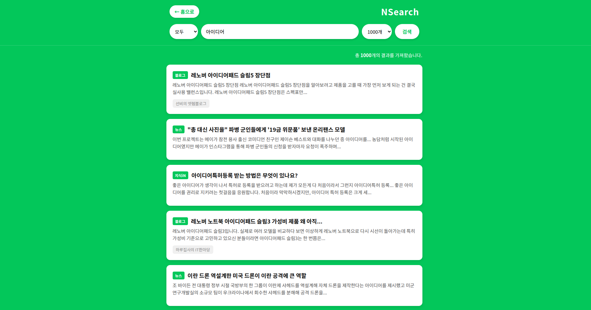

# NSearch (Naver Search Helper)

## 서비스 개요
NSearch는 네이버 오픈 API를 활용하여 사용자 맞춤형 검색 결과와 고급 필터링 기능을 제공하는 React 기반 웹 애플리케이션입니다. 단순 검색을 넘어 특정 카테고리의 데이터를 빠르게 수집할 수 있도록 설계되었습니다.

## 주요 화면
| 메인 홈 화면 | 검색 결과 및 필터링 |
| :---: | :---: |
|  |  |

## 주요 핵심 기능
* **통합 카테고리 선택**: 지식iN, 블로그, 뉴스, 웹문서, 이미지, 쇼핑 등 사용자가 원하는 영역만 골라서 정밀 검색을 수행할 수 있습니다.
* **검색량 제어 로직**: 한 페이지에 노출되는 데이터의 양을 10개에서 최대 100개까지 사용자가 직접 선택하여 정보 밀도를 조절할 수 있습니다.
* **실시간 필터링**: 방대한 네이버의 데이터 중 사용자가 필요한 카테고리의 정보만 빠르게 필터링하여 보여줍니다.

## 사용자 인터페이스 및 디자인
* **Brand Identity**: 네이버의 상징인 초록색(#03C75A)을 메인 컬러로 사용하여 사용자에게 익숙하고 깔끔한 환경을 제공합니다.
* **인스트럭션 가이드**: 검색창 하단에 반투명 박스 형태의 가이드를 상시 배치하여 별도의 매뉴얼 없이도 누구나 쉽게 숙련된 검색이 가능합니다.
* **카드 뷰 레이아웃**: 가독성 높은 카드 형태의 UI를 채택했으며, 각 카드를 클릭하면 원문 소스로 즉시 이동할 수 있습니다.

## 기술적 구현 특징
* **CORS 문제 해결**: Vite Proxy 설정을 활용하여 별도의 백엔드 서버 없이 브라우저에서 네이버 API와 안정적으로 통신합니다.
* **컴포넌트 기반 설계**: React를 사용하여 검색바, 결과 카드, 로딩 스피너 등을 모듈화하여 코드의 재사용성과 유지보수 효율을 높였습니다.
* **반응형 웹(Responsive)**: PC, 태블릿, 모바일 등 다양한 기기 환경에 최적화된 레이아웃을 제공합니다.

## 설치 및 실행 방법
1. **의존성 설치**
   ```bash
   npm install
